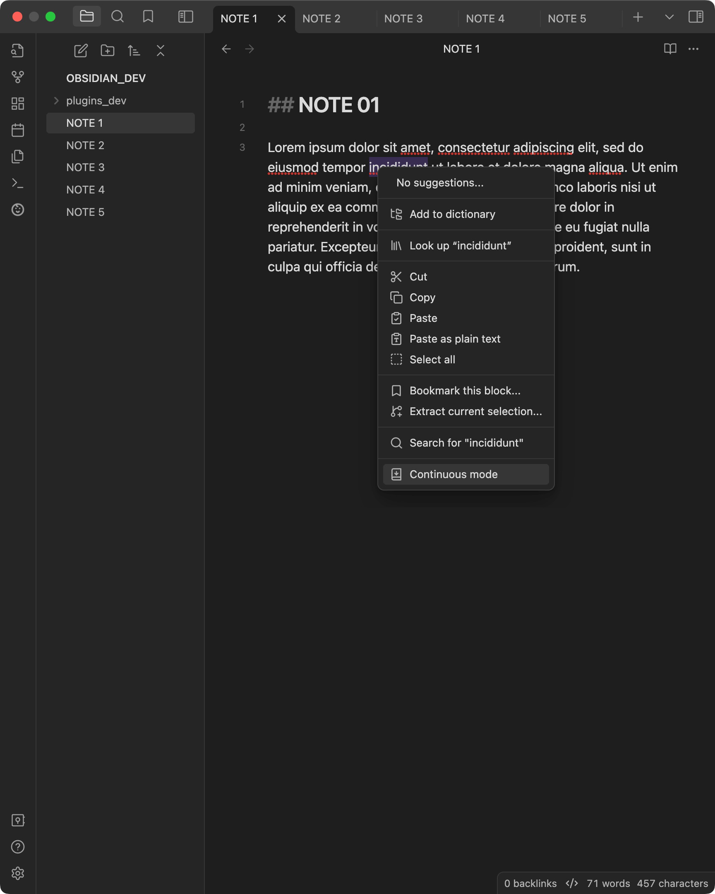
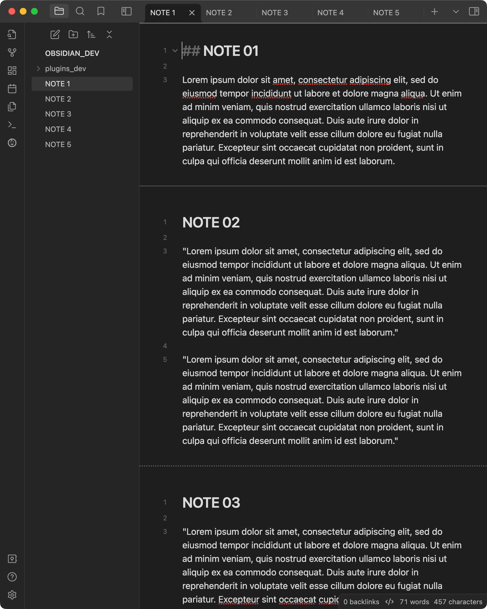

# obsidian-continuous-mode

An Obsidian plugin that displays all open notes in a tab group as if they were a single continuous document (sometimes called "Scrivenings mode").  

## Features: 
 - Toggle continuous mode via contextual menus.
 - Toggle continuous mode in active tag group from command palette.
 - Save and restore continuous mode settings in tab groups when shutting down/starting up Obsidian.
 - Reorder notes via tab header drag-and-drop.
 - Notes scroll into view when tab header is clicked.
 - Navigate between notes with arrow keys.
 - Use left and right arrow keys to scroll html notes or jump from page to page in pdfs.
 - Show/hide note headers in active tab group via menu or command palette.
 - Open all files in folder in Continuous Mode via contextual menu in File Explorer.

### Buy me a coffee:

## Screenshots:

Before: tab group with multiple notes open

After: Continuous Mode active, show various functions

