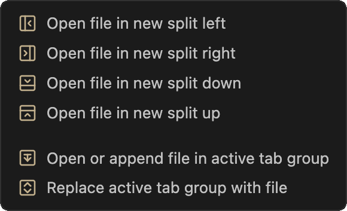
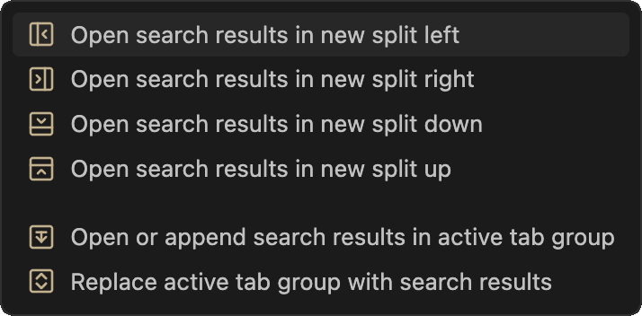
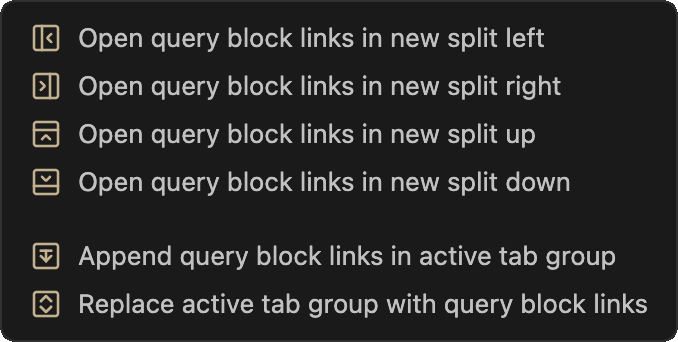
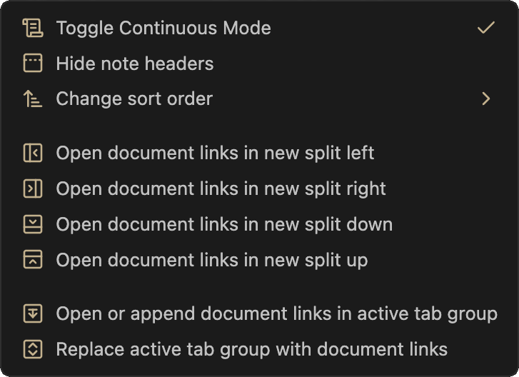

# obsidian-continuous-mode

 

## Table of Contents
- [Introduction](#introduction)
- [Usage](#usage)
	1. [Basic Example](#basic-example)
	2. [Commands](#commands)
	3. [Contextual Menus](#contextual-menus)
	4. [Opening Multiple Items](#opening-multiple-items)
	5. [Maximum number of items to open at one time](#maximum-number-of-items-to-open-at-one-time)
	6. [Allow single click to open File Explorer folders in Continuous Mode](#allow-single-click-to-open-file-explorer-folders-in-continuous-mode)
- [Other Functions](#other-functions)
- [Continuous Mode and other Plugins](#continuous-ode-and-other-plugins)
- [The Settings Window](#the-ettings-window)
- [Troubleshooting](#troubleshooting)

## Introduction
A plugin for Obsidian that displays all open notes in a tab group as if they were a continuous scrollable document (sometimes called “Scrivenings mode”). Also provides methods to open multiple notes from the File Explorer, search results, document links, or dataview/query blocks.

### 

## Usage:  

### Basic Example
With multiple notes already open, toggle Continuous Mode and note headers, scroll notes into view by clicking tab or making it active:

### Commands
Two commands are currently available:
- Toggle continuous mode in active tab group
- Toggle visibility of note titles in active tab group

### Contextual Menus

This plugin adds a “Continuous Mode” menu item to the contextual menus in various parts of the Obsidian UI. The position of the menu item and the available options differ according to the...er...context.

#### Basic Functions
  

These are available in the Tab Group Menu, File Menu, Selected Tab Menu, and Editor Menus.  

#### Opening Multiple Items
The contextual menus allow you to open multiple notes from the File Explorer, search results, file, or dataview/query block contextual menus. You can:
- open items in a new split (left, right, up, down).  
- open or append items in the active tab group; files will not be duplicated if they are already open.  
- replace files in the active tab group with files from the selected folder (i.e., close all open notes in active tab group and replace with folder items).  

    

    

  

- You can filter the files that are opened by type (e.g., markdown, images, canvas, etc.), extension, or file name in the Settings.  
- Opening folders is not recursive—only the top level notes will be opened.  
- Sort order is respected when opening folders. Once opened, sort order does not dynamically update when it is changed in the file explorer; reopen the folder in Continuous Mode to accomplish this.  
- Similarly, after opening multiple files, the tab group will not dynamically reflect any changes you make to the folder structure in the file explorer. If you do make any changes (e.g., move, create, or delete a note), you'll have to reopen the folder to see the updated structure.

#### Change sort order submenu
Change the order of the open notes in the active tab group.  

  

### Maximum number of items to open at one time
You can set the maximum number of file to be opened at one time in the Settings. This allows you to open the items in a folder incrementally by repeatedly selecting “Open or append items in Continuous Mode”. This is useful for dealing with folders containing a large number of items.

### Allow single click to open File Explorer folders in Continuous Mode
Enable this in the Settings, with a default action to perform (e.g., “Open folder in new split left”).

## Other functions  
- Automatically save and restore continuous mode tab group settings when shutting down/starting up Obsidian.  
- Navigate between notes with up and down arrow keys (and left and right arrow keys if at the beginning or end of the note).  
   - Also use left and right arrow keys to scroll html notes or jump from page to page in pdfs.  
   - If editing a canvas file (i.e., canvas leaf is active), click the background to deselect any active node and use the up and down arrow keys to navigate to the adjacent note.  
   - Similarly use the arrow keys to navigate out of an active graph view. Use shift+arrow keys to move the graph around.   
- While editing notes, the insertion point will scroll so as to remain more or less in the center of the screen, similar to “typewriter mode”; this behavior can be disabled in the settings.  
- Scroll notes into view by clicking the tab header. Note: scroll into view fails when clicking the tab headers the first time, and before the note has been scrolled into view at least once. This appears to be an issue with Obsidian.  
- Reorder notes in tab group via tab header drag-and-drop.  

## Continuous Mode and other Plugins  
The Continuous Mode menus are available or compatible with the following third-party plugins which add to or modify the File Explorer or provide new file views:
- “<a href="https://obsidian.md/plugins?id=file-tree-alternative" target="_blank">File Tree Alternative</a>” plugin.  
- “<a href="https://github.com/Quorafind/Outliner.MD" target="_blank">Outliner.MD</a>” plugin.
- “<a href="https://obsidian.md/plugins?id=longform" target="_blank">Longform</a>” plugin. Basic support: Files are opened in their project or scene order (i.e. not alphabetically); however, tab order is not automatically refreshed when the project order is changed, nor are new files automatically opened when new scenes are created. While technically feasible, there are too many variables to make this work predictably. Instead, open the project again in Continuous Mode using the "replace" option.

## The Settings Window

  

## Troubleshooting
- “No readable files found”: If you know that there are readable files in the source you are trying to open, check the plugin settings to make sure that the “Filter file types” are set to include the file types .

