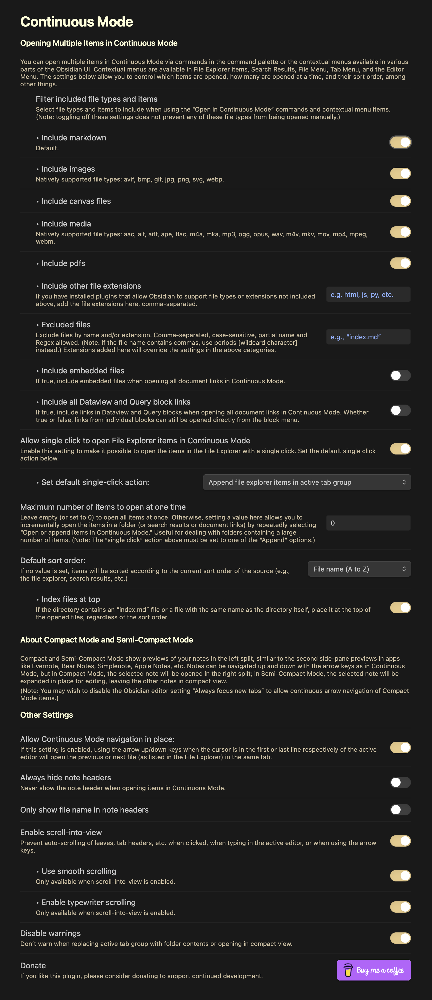

# continuous-mode

 

## Table of Contents  
- [Introduction](#introduction)  
- [Usage](#usage)  
	1. [Basic Example](#basic-example)  
	3. [Contextual Menus](#contextual-menus)  
	4. [Opening Multiple Items](#opening-multiple-items)  
	5. [Compact Mode](#compact-mode)  
- [Keyboard navigation in and between notes](#keyboard-navigation-in-and-between-notes)
- [Other Functions](#other-functions)  
- [Commands](#commands)  
- [The Settings Window](#the-settings-window)  
	5. [Maximum number of items to open at one time](#maximum-number-of-items-to-open-at-one-time)  
	6. [Allow single click to open File Explorer folders in Continuous Mode](#allow-single-click-to-open-file-explorer-folders-in-continuous-mode)  
- [Continuous Mode and other Plugins](#continuous-mode-and-other-plugins)  
- [Troubleshooting](#troubleshooting)  

## Introduction
A plugin for Obsidian that displays all open notes in a tab group as if they were a continuous scrollable document (sometimes called “Scrivenings mode”). Continuous Mode is available for notes in the Main Split and panes in the Sidebars. The plugin also allows keyboard navigation between notes, and provides several ways to open multiple notes at a time from the File Explorer, search results, document links, or dataview/query blocks.

### <a href="https://www.buymeacoffee.com/fiLtliTFxQ" target="_blank"></a>

## Usage:  

### Basic Example
With multiple notes already open, you can use the contextual menu to toggle Continuous Mode in the active tab group and to toggle visibility of note headers; you can scroll notes into view by clicking the tab or making the note active:


### Contextual Menus

This plugin adds a “Continuous Mode” menu item to the contextual menus available in various parts of the Obsidian UI. The position of the menu item and the available options differ according to the...er...context.

#### Basic Functions

These menu items are available in the Tab Group Menu, File Menu, Selected Tab Menu, and Editor Menus.  

  

##### Change sort order submenu   

  


#### Opening Items in Continuous Mode  

When the context menu is opened on File Explorer items (folders or individual files), Search results, and other locations, the Continuous Mode menu will show options to:
- Open the items in a new split (left, right, up, down).  
- Open (or append) the items in the active tab group. Files will not be duplicated if they are already open.  
- Replace the open files in the active tab group with the items (i.e., close all open notes in active tab group and replace with folder items). This action will show a warning before executing; you can disable this and similar warnings in the settings.  

  

This menu will show “file,” “document links,” “query block links,” “search results” instead of “folder contents” depending on the context.  

See the Settings for options to:  
 - Filter (include or exclude) the folder items that are opened by type (e.g., markdown, images, canvas, etc.), extension, or file name;  
 - Set the number of items to open at one time.  
 - Set the sorting order when opening multiple items.  
 - Open File Explorer folder contents with one click.  

**Notes:**   
 - Opening folders is not recursive—only the top level notes in the folder will be opened.  
 - You can select multiple non-consecutive files (but not [yet?] folders) in the File Explorer (Alt/Opt + Click) and open them via the context menu.  
 - Sort order of the source (e.g., File Explorer, Search Results) is respected when opening multiple items. Once opened, sort order does not dynamically update when it is changed in the file explorer; reopen the folder in Continuous Mode to accomplish this or change the sort order via the tab group menu. In the Settings you can choose the default sort order when opening multiple items.  
 - Similarly, after opening multiple files, the tab group will not dynamically reflect any changes you make to the folder structure in the file explorer. If you do make any changes (e.g., move, create, or delete a note), you'll have to reopen the folder to see the updated structure.

### Compact Mode and Semi-Compact Mode 
Compact Mode and Semi-Compact Mode emulate the note preview sidebar found in apps like Bear or Evernote.

Compact Mode  
 

Semi-Compact Mode  
  
 - When Compact Mode is active, the left split will preview the first few lines of each open note (or a thumbnail for images). Clicking a preview or otherwise making it active will open the note in the right sidebar.  
 - When Semi-Compact Mode is active, the active note will be displayed normally.  
 - Compact Mode notes can be navigated with the arrow keys.  
 - Added user settings to open clicked file explorer folders or files in compact mode.  
 - Note: You may wish to disable the Obsidian editor setting ```Always focus new tabs``` to allow continuous arrow navigation of Compact View items.  

## Keyboard navigation in and between notes  
In Continuous Mode you can navigate between open notes with the up and down arrow keys, and with the left and right arrow keys if the cursor is at the beginning or end of the note.  
 - In pdfs, the left and right arrow keys will jump from page to page.
 - In HTML files, the left and right arrow keys will scroll the page.
 - In an active canvas leaf, click the background to deselect any active node and use the up and down arrow keys to navigate to the adjacent note.  
 - In an active graph view, similarly use the arrow keys to navigate to the adjacent note. Use ```shift + arrow``` keys to move the graph around.   
 - While editing notes, the insertion point will scroll so as to remain more or less in the center of the screen, similar to “typewriter mode”; this behavior can be disabled in the settings.  

#### Navigate in place  
If the `Allow Continuous Mode navigate in place` setting is enabled, using the Arrow Up/Down keys when the cursor is in the first or last line respectively of the active editor will open the previous/next file (as listed in the File Explorer) in the same tab. This means that you can easily scan through files without opening new tabs or switching to the File Explorer.  

Two open-in-place commands are available as well, so you don't have to arrow up/down the whole note to get to the next one:  ```Open next File Explorer item in place``` and ```Open previous File Explorer item in place```.  
 - Because of certain limitations in the Obsidian API, getting the previous/next files is limited to the current directory level and any nested directories. This means that if your vault is structured around directories, you won’t be able to use this method alone to access all your files.  
 - As an optional workaround, you may find it helpful to install my “Smooth Explorer” and “Smooth Navigator” plugins.  
   - <a href="https://github.com/gasparschott/smooth-explorer" target="_blank">Smooth Explorer</a> allows keyboard navigation of the File Explorer, with options to open selected items in the most recent active leaf (similar to navigate in place) or new tabs. If this plugin is enabled, the File Explorer will be automatically focused for navigation when the previous/next item is a directory, allowing Arrow Up/Down navigation to continue uninterrupted.
   - <a href="https://github.com/gasparschott/smooth-navigator" target="_blank">Smooth Navigator</a> provides a suite of commands that makes it easier to switch between splits and tabs (e.g., to and from the File Explorer and the most recent active note).

## Other functions   
 - Notes will scroll into view when you click the tab header. Note: this may fail when clicking tab headers for the first time after start-up, and before the note has been scrolled into view at least once; this appears to be an issue with Obsidian.  
 - Clicking a line in a note will scroll that line into view.
 - You can reorder notes in a tab group by dragging and dropping the tab headers.  
 - Automatically save and restore continuous mode tab group settings when shutting down/starting up Obsidian.  

## Commands
Many of the above functions can be invoked via the Command Palette.  
Here is a complete list of available commands:  

 - Append document links in active tab group  
 - Append search results in active tab group  
 - Open active document links in new split down  
 - Open active document links in new split left  
 - Open active document links in new split right  
 - Open active document links in new split up  
 - Open current search results in new split down  
 - Open current search results in new split left  
 - Open current search results in new split right  
 - Open current search results in new split up  
 - Open next File Explorer item in place  
 - Open previous File Explorer item in place  
 - Open selected file explorer item in new split append  
 - Open selected file explorer item in new split down  
 - Open selected file explorer item in new split left  
 - Open selected file explorer item in new split replace  
 - Open selected file explorer item in new split right  
 - Open selected file explorer item in new split up  
 - Replace active tab group with document links  
 - Replace active tab group with search results  
 - Sort active tab group by created time (new to old)  
 - Sort active tab group by created time (old to new)  
 - Sort active tab group by file name (A to Z)  
 - Sort active tab group by file name (Z to A)  
 - Sort active tab group by modified time (new to old)  
 - Sort active tab group by modified time (old to new)  
 - Toggle compact mode  
 - Toggle Continuous Mode in active tab group  
 - Toggle Continuous Mode in left sidebar  
 - Toggle Continuous Mode in right sidebar  
 - Toggle Continuous Mode in root tab groups  
 - Toggle semi-compact mode  
 - Toggle visibility of note titles in active tab group  
 - Toggle visibility of note titles in root tab groups  
 - Toggle visibility of note titles left sidebar  
 - Toggle visibility of note titles right sidebar  

## The Settings Window

  

## Continuous Mode and other Plugins  
The Continuous Mode menus are available or compatible with the following third-party plugins, which add to or modify the File Explorer or provide new file views:

 - “<a href="https://obsidian.md/plugins?id=file-tree-alternative" target="_blank">File Tree Alternative</a>” plugin.  
 - “<a href="https://github.com/Quorafind/Outliner.MD" target="_blank">Outliner.MD</a>” plugin.  
 - “<a href="https://obsidian.md/plugins?id=longform" target="_blank">Longform</a>” plugin. Basic support: Files are opened in their project or scene order (i.e. not alphabetically); however, tab order is not automatically refreshed when the project order is changed, nor are new files automatically opened when new scenes are created. While technically feasible, there are too many variables to make this work predictably. Instead, open the project again in Continuous Mode using the "replace" option.

**Conflicts:**
 - “<a href="https://obsidian.md/plugins?id=folder-notes" target="_blank">Folder Notes</a>”: There is a conflict with the Folder Notes plugin and the "Single click to open file explorer items" action in Continuous Mode whereby Folder Notes captures mouse clicks on file explorer folders, preventing the action from succeeding. A possible solution is to change the “Key for creating folder note” and “Key for opening folder note” settings to ```Cmd+Click``` or ```Alt+Cmd```.
 - “<a href="https://github.com/oxdc/obsidian-vertical-tabs" target="_blank">Vertical Tabs</a>”: This plugin can prevent opening "Compact Mode" previews in the right split. The solution is to change the Vertical Tabs “Navigation strategy” setting from “Obsidian+” to “Obsidian”.

If you find that Continuous Mode interferes with or doesn’t work properly with a particular plugin, please let me know.


## Troubleshooting
 - “No readable files found”: If you know that there are readable files in the source you are trying to open, check the plugin settings to make sure that the “Filter file types” are set to include the file types. If you are attempting to open document or query block links, check that the links are valid and point to existing files.

